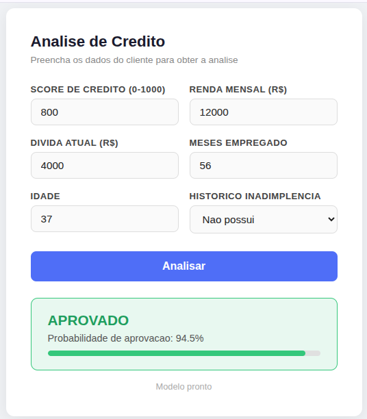

# Projeto 3 — Aprovacao de Credito com Rede Neural

Cenario de estudo para aprender como **definir regras de negocio**, **preparar dados de treino** e **treinar um modelo de classificacao binaria** com TensorFlow.js — com interface web para consulta.



---

## Cenario

Um banco ficticio precisa decidir automaticamente se aprova ou reprova pedidos de credito pessoal.

Em vez de programar regras `if/else` manualmente, uma rede neural e treinada para tomar essa decisao com base em exemplos historicos de clientes.

---

## Features do Modelo

| Campo | Descricao | Tipo |
|---|---|---|
| `score_credito` | Pontuacao de 0 a 1000 (historico financeiro) | numero |
| `renda_mensal` | Renda bruta mensal em reais | numero |
| `divida_atual` | Total de dividas ativas em reais | numero |
| `meses_empregado` | Meses de emprego continuo | numero |
| `historico_inadimplencia` | 1 se ja caloteou, 0 se nunca | binario |
| `idade` | Idade em anos | numero |
| `aprovado` | **Label: 1 = aprovado, 0 = reprovado** | binario |

---

## Regras de Negocio

As regras abaixo foram usadas para rotular os dados em `clientes.json`. O modelo aprende a replicar essas regras a partir dos exemplos, sem recebe-las explicitamente.

```
APROVADO se:
  score_credito >= 650  E  divida / renda < 0.35
  score_credito >= 800  (independente de outros fatores, incluindo inadimplencia)

REPROVADO se:
  score_credito < 350
  score_credito < 500  E  historico_inadimplencia = 1
  meses_empregado < 10  E  score_credito < 600
  renda_mensal < 2000   E  divida_atual > 1000
```

---

## Estrutura do Projeto

```
projeto3/
  data/
    clientes.json       -> exemplos rotulados de clientes (features + label)
    regras.md           -> regras de negocio documentadas
  web/
    index.html          -> interface web para consulta ao modelo
  content/
    image/
      imagem_projeto.png
  modelo/               -> modelo treinado (gerado apos npm run treinar)
  index.js              -> treino e previsao via terminal
  teste.js              -> suite de testes por regra de negocio
  package.json
```

---

## Como Rodar

### Instalar dependencias

```bash
npm install
```

### Treinar o modelo

Executa o treino com os dados de `clientes.json` e salva o modelo na pasta `./modelo/`.

```bash
npm run treinar
```

### Fazer uma previsao pelo terminal

Carrega o modelo salvo e executa a previsao para o cliente definido em `index.js`.

```bash
npm run start
```

### Executar os testes

Valida o modelo contra casos de teste por regra de negocio e exibe quantos passaram.

```bash
npm run teste
```

### Rodar a interface web

Sobe um servidor estatico com `http-server` e abre a interface no browser.

```bash
npm run web
```

> Requer `http-server` instalado globalmente: `npm install -g http-server`

---

## Interface Web

A interface web permite consultar o modelo treinado sem necessidade de terminal.

- Preencha os dados do cliente no formulario
- Clique em **Analisar**
- O resultado exibe **APROVADO** ou **REPROVADO** com a probabilidade e uma barra visual

O modelo e carregado direto no browser via TensorFlow.js. Nenhum backend e necessario.

---

## Arquitetura do Modelo

```
Entrada: 6 features normalizadas
  → Dense(16 neuronios, ativacao ELU)
  → Dense(1 neuronio, ativacao Sigmoid)
Saida: probabilidade entre 0 e 1
```

- **Sigmoid** na saida: converte o valor em probabilidade (classificacao binaria)
- **Binary Crossentropy**: funcao de perda adequada para saida 0/1
- **Adam**: otimizador adaptativo para convergencia estavel
- **300 epocas**: suficiente para aprender os padroes sem overfitting excessivo

---

## Conceitos Trabalhados

| Conceito | Onde aparece |
|---|---|
| Regras de negocio | `data/regras.md` — base para os labels |
| Normalizacao Min-Max | Cada feature normalizada pelo range do dataset |
| Classificacao binaria | Sigmoid + Binary Crossentropy |
| Salvar e carregar modelo | `model.save()` e `tf.loadLayersModel()` |
| Validacao por casos de teste | `teste.js` com casos por regra |
| Interface web sem backend | TensorFlow.js no browser via CDN |
